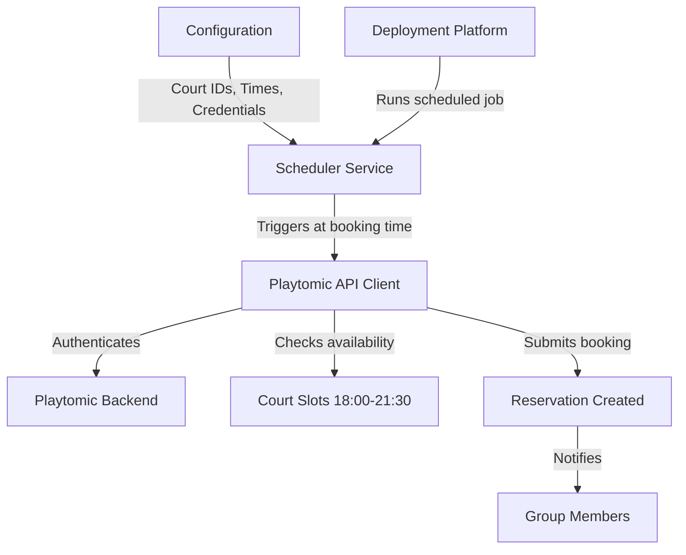

# Playtomic Automated Booking System

## Research Summary

### Key Findings

- **No official API needed**: Playtomic doesn't offer a public API, but community solutions exist that reverse-engineer the booking endpoints
- **Existing solution available**: `playtomic-scheduler` (GitHub) is an MIT-licensed Flask-based server specifically built for this use case
- **Cost**: Completely free - open source, no API fees
- **Deployment**: Multiple free/cheap options available (GitHub Actions, Render, Railway)

### Why Adapt Existing Project

- Proven approach already working in production
- Saves weeks of development time
- MIT license allows free modification and deployment
- Handles authentication and booking flow already
- Reduces risk vs. reverse-engineering from scratch

## Recommended Architecture



## Implementation Plan

### Phase 1: Setup & Exploration

1. **Clone and examine** the `playtomic-scheduler` repository to understand its structure
2. **Identify required configuration**:

   - Playtomic account credentials
   - Club/Venue ID
   - Court preferences
   - Time slots (18:00-21:30 weekdays)
   - Booking release time (when slots open daily)

3. **Test locally** to verify it works with your Playtomic account

### Phase 2: Customization

1. **Configure booking parameters**:

   - Set target time slots (18:00-21:30)
   - Configure weekday-only scheduling
   - Set preferred court(s)
   - Add group member notification system

2. **Optimize timing**:

   - Implement pre-booking checks (30 seconds before release)
   - Add retry logic for the critical 5-second window
   - Handle rate limiting and errors gracefully

3. **Add features**:

   - Success/failure notifications (email/SMS/Telegram)
   - Logging for booking attempts
   - Multiple account support (if group members want to rotate)

### Phase 3: Deployment

**Recommended: GitHub Actions (Free & Reliable)**

- Free for public repos, 2000 minutes/month for private
- Native cron scheduling support
- Runs automatically, no server management
- Alternative: Render free tier or Railway for always-on service

### Phase 4: Security & Configuration

1. **Secure credential storage**:

   - Use environment variables or secrets management
   - Never commit credentials to repository

2. **Create configuration file**:

   - JSON/YAML config for easy updates
   - Separate configs for different booking scenarios

3. **Add monitoring**:

   - Booking success rate tracking
   - Alert on failures

## Technical Stack

- **Language**: Python (existing project uses Flask)
- **Dependencies**: Based on playtomic-scheduler requirements
- **Deployment**: GitHub Actions (free) or Render/Railway (free tier)
- **Storage**: Configuration in repo, credentials in secrets

## Files Structure

```
playtomic-bookings/
├── src/
│   ├── scheduler.py          # Main booking scheduler
│   ├── playtomic_client.py   # API interaction layer
│   └── config.py             # Configuration management
├── config/
│   └── booking_config.yaml   # Your booking preferences
├── .github/
│   └── workflows/
│       └── auto-book.yml     # GitHub Actions schedule
├── requirements.txt
└── README.md
```

## Critical Considerations

1. **Terms of Service**: Verify Playtomic's ToS allows automation (may need to check)
2. **Timing precision**: Must execute within 5-second window - use precise scheduling
3. **Reliability**: System must run consistently - GitHub Actions is reliable for this
4. **Account security**: Store credentials securely, never in code
5. **Error handling**: Network issues, rate limits, booking conflicts

## Next Steps

1. Examine the existing `playtomic-scheduler` codebase
2. Set up local development environment
3. Test with your Playtomic account credentials
4. Customize for your specific club and time slots
5. Deploy to GitHub Actions or chosen platform
6. Monitor and iterate based on success rate